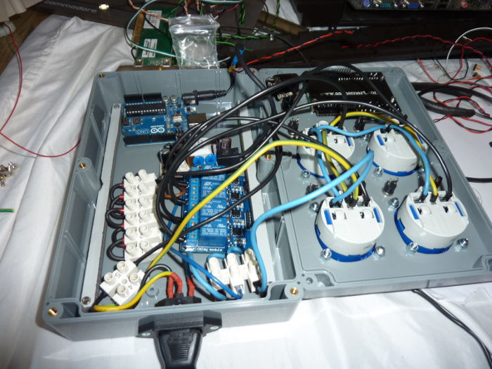

#SocketIntervals-Arduino
================

####LIBRARIES:

- EEPROM.h (https://www.arduino.cc/en/Reference/EEPROM)
- LiquidCrystal.h (https://www.arduino.cc/en/Reference/LiquidCrystal)
- SimpleUI16x2.h (https://github.com/dserv01/SimpleUI16x2)

####HARDWARE:

- Arduino Uno/Nano or similar
- Relay board with 1-4 relays
- female to female jumper wire
- enclosure and parts to attach everything into it
- power switch and fuse for AC power
- IEC female connector or IEC wire for AC input
- 1-4 electrical outlets
- luster terminals
- wire for AC power and wire end ferrules
- *optional:* Keypad LCD shield 16x2
- *optional:* step down regulator 5V (if more than one relay is going to be in closed state simultaneously)
- *optional:* soldered PCB with 4x 3,3 kΩ resistors and switches
- *optional:* 4 LEDS with 330 Ω resistors
- *optional:* USB cable to make it possible to program the arduino after everything was assembled

####WIRING:

- Place LCD shield on top of the Arduino board
- Connect power supply to Arduino (I used a Nokia ACH-6E with 10V 740mA)
- Connect Arduino digital pins 2, 3, 11, 12 to relay board IN1, IN2, IN3, IN4
- Connect VCC to Arduino VCC and GND to Arduino GND an make sure the jumper on the relay board is set (VCC+JDVCC)

If you use external power supply for relais board
- Don't connect relay GND to Arduino GND and remove jumper on relay board
- Connect the power supply (only if it provides 5V) or the step down regulator + to JDVCC and - to GND on relay board

If you want status leds
- Connect Arduino analog pins A2, A3, A4, A5 to status leds with 330 Ω resistor and back to GND

If you want manual on pins
- Solder a PCB with 3,3 kΩ for multiple buttons on one analog pin (there are tons of tutorials how to do this online) and connect it to analog pin A1 and back to GND
- Connect L to Switch and then a to a fuse
- After switch and fuse, connect L to every relay one closing contact
- Connect other closing contact of one relay to one outlet, do this for all relays.
- Connect N and Ground to all Sockets
- Connect the power supply to L (after switch and fuse) and N
- If you're using a power supply that doesn't provide 5V, connect it to a step down regulator for 5V if you want to power the relay board externally

